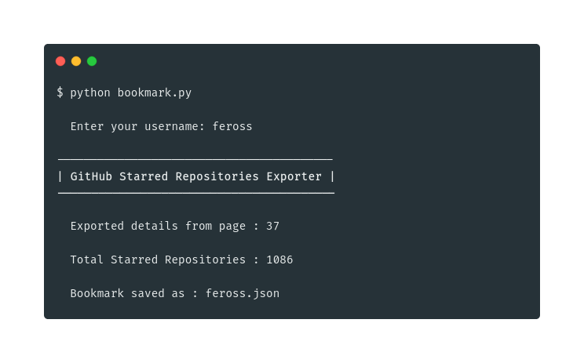

<h1 align="center"></h1>

<p align="center">Bookmark Starred Repositories</p>

## Description

Export all your (or any other user's) starred repositories as JSON. The script doesn't rely on GitHub API, supports pagination, and it cleans the repo's description for the sake of readability.

## Install

```sh
$ curl -OL https://raw.githubusercontent.com/CodeDotJS/allstars/master/bookmark.py
```

## Usage

```sh
$ python bookmark.py
```

## Screenshot

<p align="center"></p>

## License

MIT
